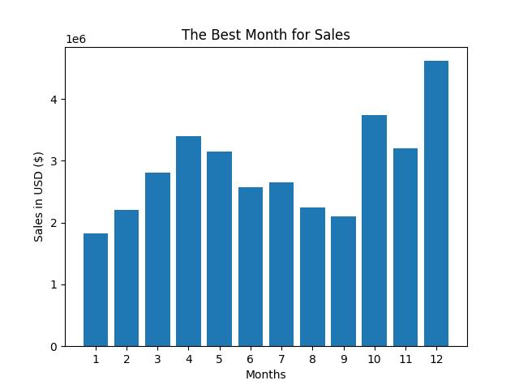
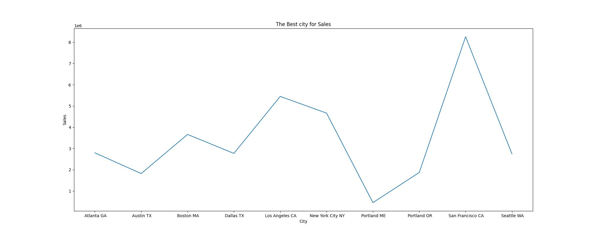
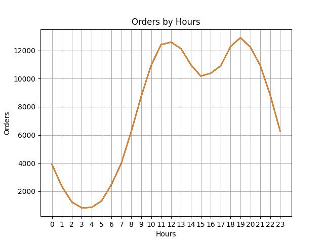
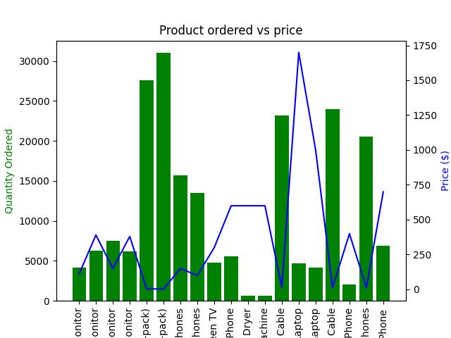

# E-Commerce Sales Analysis

## Table of Contents 

- [Project Overview](#project-overview)
- [Data Sources ](#data-sources)
- [Tools](#tools)
- [Methodology](#methodology)
- [Exploratory Data Analysis](#exploratory-data-analysis)
- [Data Analysis](#data-analysis) 
- [Results Findings](#results-findings)
- [Recommendations](#recommendations)
- [Next Action](#next-action)
- [Tableau](#tableau)

## Project Overview 
This project investigates the sales of electronics in the market for the years 2019 and 2020. The primary goal is to derive insights into the types of electronic products sold during these years and analyze the revenue generated from these sales.

Key objectives of the analysis include:

Identifying Sales Trends: Examine which types of electronic products were most popular in 2019 and 2020, along with their respective revenue contributions.

Revenue Analysis: Evaluate overall revenue trends, pinpointing the best-performing months and cities for electronic sales.

Optimizing Marketing Strategies: Analyze the best times for advertisements based on sales patterns to maximize revenue potential.

Association Analysis: Investigate which products are frequently sold together to inform bundling strategies and promotional campaigns.

By leveraging data analysis techniques, this project aims to provide actionable insights that can help stakeholders make informed decisions to enhance sales performance and revenue growth in the electronics market.

### Data Sources 

Data: The primary dataset used for this analysis is in the data folder. 

### Tools 

- Pandas- Data cleaning and processing
  
- Seaborn- Creating visuals
  
- Matplotlib- Creating visuals
  
- statsmodels.api- for statical test
  
- Sklearn-for machine learning and statical modeling
  
- Tableau -Creating reports

## Methodology 
  In the data analysis phase, the following tasks were performed:
  
  1. Data loading and inspection.
     
  2. Data cleaning and manipulation using Python functions and libraries.
     
  3. Handling missing values.
     
  4. Performed EDA, and ran statical test.
     
  5. Created a Tableau dashboard to communicate key findings. 

## Exploratory Data Analysis

EDA involved exploring the sales data to answer key questions such as: 

- What was the best month for sales? How much was earned that month?
  
- Which cities have the highest number of sales?
  
- What time should we display adverts to maximize profit?
  
- What products are often sold together?
  
- What products are sold the most and why?

## Data Analysis 
Here are some examples of the visuals from the analyses 

The bar graph and line plot above indicate that December is the peak month for sales, with a remarkable sales revenue of $4,613,443.34. This trend is understandable, as many holidays occur during the October to December period, driving increased consumer spending. Consequently, October and November also show significant sales figures, reflecting the lead-up to the holiday shopping season. 

The line plot illustrates that Los Angeles and San Francisco are the top cities for electronic sales in California. This trend may be attributed to California being the nation's largest manufacturing state, with electronics representing a significant portion of its industrial sector. Additionally, the presence of leading technology companies, such as Tesla, further boosts electronic sales in these cities. 

This line plot displays the quantity of orders by hour, revealing that 11 AM and 7 PM are the peak times for orders. This trend may be attributed to the fact that at 11 AM, many people are awake and on their lunch breaks, while at 7 PM, individuals are typically at home after work. Therefore, these hours represent optimal opportunities for advertising efforts.

 

The bar graph and line plot compare the most ordered products with their respective prices. Notably, while AAA batteries are the most ordered item, they have the lowest price among the products displayed.

## Results Findings
The analysis results are summarized as follows: 

1. The top revenue month is December as many holidays occur during this month. October and November also show significant sales figures, reflecting the lead-up to the holiday shopping season.
   
2. California has the best-performing cities in terms of sales and revenue.
   
3. The hours of 11 am and 7 pm should be targeted for marketing efforts as they bring in the most revenue.
   
4. The MacBook Pro, AAA batteries, iPhone, and gaming monitors are among the most sold products.

## Recommendations 
Based on the analysis, the following is recommended: 
- Focus on marketing and promotional efforts during peak seasons and hours to maximize revenue.
  
- Expand and promote products in major tech cities, while also exploring growth opportunities in emerging markets such as Austin, Texas, and Atlanta, Georgia.
  
- Develop a customer segmentation strategy to specifically target younger demographics, as they are more likely to purchase MacBooks, iPhones, and gaming products.
  
## Next Action
Further actions to enhance this project could include examining which state has the highest number of orders per hour, as well as identifying the demographic segments with the most orders. Additionally, sourcing more data could enrich the analysis, enabling deeper insights and more comprehensive evaluations of sales trends and customer behavior.

## Tableau 
Tableau [Download here](https://public.tableau.com/app/profile/thierno.barry8424/viz/ElectronicSales_16927830576570/Dashboard1)

