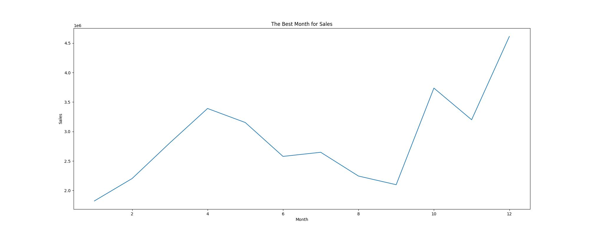
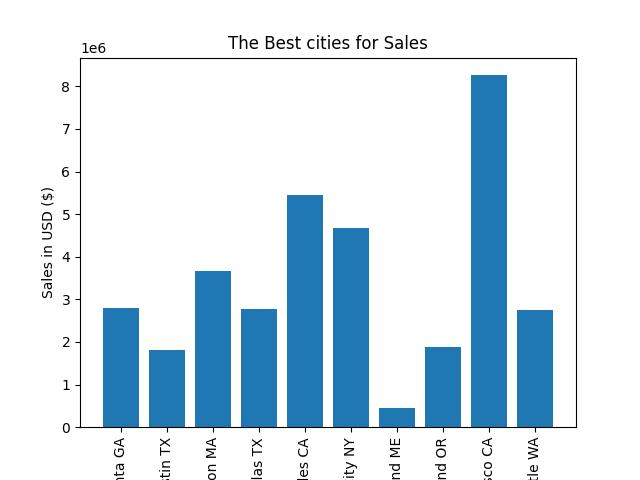

# Sales_data

This project investigate the sales of electronics in the market for the years 2019 and 2020. In this data I try to get insight of type of electronic sold during these years and revenue, also examining factors to increase revenue such as the best month for sale, the best city, the best time for advertisements and also the products that are often sold together determining the revenue of the sales. 

## Libraries

Pandas 

Seaborn

Matplotlib

scipy.stats 

Numpy 

statsmodels.api

sklearn.preprocessing

sklearn.model_selection

sklearn.linear_model

sklearn.tree

os

Tableau

## Methodology
To start I cleaned the data using Python functions and libraries, then dropped all  null values and changed some of the data types and created new columns from the existing columns for more analysis. Furthermore, usI used the new dataframe to perform EDA, CDA and also linear regression and a decision tree. Lastly, I created a tableau dashboord of the sales data. 
## Visuals & Results

The bar graph and lineplot above display December as the best month for sales, with a sales revenue of $4613443.34 and this is understandable because many of the holidays are during October to December that is also why October and November have  a big sale. 

In this bar graph and lineplot as illustrated the two cities of CA, Los Angeles and San Francisco are the best cities for electronic sales. This could be due to the fact that California is the nation's largest manufacturing state. Also, electronics is California's largest industrial sector, and it is home to top companies such as Tesla. 

This lineplot shows the quantity of orders by hours and as shown 11 am and 7 pm are the hours in which people tend to order the most and this could be because at 11 am most people are awake or at lunch and at 7 pm most people are at home from work, there these hours are best for advertisement. 

The bar graph and line bar compare the most ordered product to its price, and despite being the most ordered items, the AAA batteries cost the least out of the products displayed. 

# Next Action
further action that can be taken to better this project, could be to examine which state has the most orders per hour, also I could look for more data to add to do further examination and analysis. 
## Tableau 
https://public.tableau.com/app/profile/thierno.barry8424/viz/ElectronicSales_16927830576570/Dashboard1 